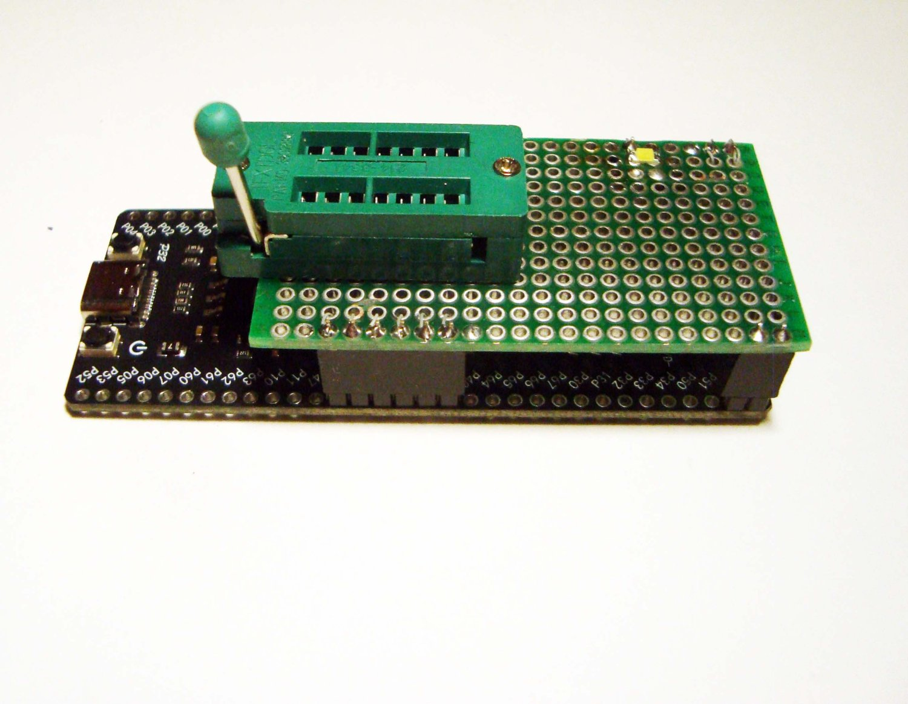

# Raccoon-Flash-Explorer-Demo

Licensed: [BSD-3-Clause](LICENSE-BSD), [GPL-2.0](LICENSE-GPL)

Demo/SDK version of RFE

 

This is a simplified version of the firmware. Works 2 times faster than 341.

It can be assembled from ready-made boards from AliExpress ($2) in 30 minutes.

It does not have:
Overload and reverse polarity protection.
1.8V support and automatic power supply selection.
Changing of status registers.
Verification of data.
Pins test.
Reduced operating speed.
USB VID/PID changed to standard.

Requires minor changes to work with a non-original circuit, you'll figure it out.
Based on the MSD example from STC.
The code is very ugly in places, don't pay attention. I learned programming from scratch while creating this project, and didn't have time to remake everything into a beautiful form.

You can use it as usual, or use it as an SDK for your own tricks)

[Troubleshoot](https://forum-monitor.net.ru/threads/685863/post-6869854)

[Assembly guide](https://forum-monitor.net.ru/threads/685863/post-6870264)

**********     DISCLAIMER     **********

THIS SOFTWARE AND HARDWARE ARE POSTED FOR EDUCATIONAL PURPOSES ONLY!

USE OF THIS SOFTWARE AND HARDWARE WITHOUT THE RELEVANT KNOWLEDGE, WITHOUT THE RELEVANT EXPERIENCE, OR FOR ANY PURPOSES OTHER THAN EDUCATIONAL - IS PROHIBITED!

BY USING THIS SOFTWARE AND HARDWARE YOU AUTOMATICALLY AGREE THAT YOU ARE SOLELY RESPONSIBLE FOR DAMAGED EQUIPMENT, FOR ILLEGAL, UNLAWFUL USE, AND FOR ANY OTHER CONSEQUENCES RELATED TO ITS USE!

********************
Это упрощённая версия прошивки. Работает в 2 раза быстрее чем 341.

Собирается из готовых плат с алика за 200р за полчаса

В ней отсутствуют:
  Защиты от перегрузок и неправильной полярности.
  Поддержка 1,8V и автовыбор питания.
  Изменение регистров статуса.
  Верификация данных.
  Pintest.
  Скорость работы снижена.
  USB VID/PID изменены на стандартные.

Для работы с неоригинальной схемой требует небольших изменений, разберётесь.
Сделано на основе примера MSD от STC.
Местами код очень некрасивый, не обращайте внимания. С нуля учился программированию в процессе создания этого проекта, и не успел всё переделать в красивый вид.

Можно пользоваться как обычно, или же использовать как SDK для своих приколюх) 

[Решение проблем](https://forum-monitor.net.ru/threads/685863/post-6869854)

[Инструкция по сборке и прошивке](https://forum-monitor.net.ru/threads/685863/post-6870264)

**********     ОТКАЗ ОТ ОТВЕТСТВЕННОСТИ     **********

ДАННОЕ ПРОГРАММНОЕ И АППАРАТНОЕ ОБЕСПЕЧЕНИЕ ВЫЛОЖЕНО ИСКЛЮЧИТЕЛЬНО В ОЗНАКОМИТЕЛЬНЫХ ЦЕЛЯХ! 

ИСПОЛЬЗОВАНИЕ ДАННОГО ПРОГРАММНОГО И АППАРАТНОГО ОБЕСПЕЧЕНИЯ БЕЗ СООТВЕТСТВУЮЩИХ ЗНАНИЙ, БЕЗ СООТВЕТСТВУЮЩЕГО ОПЫТА, ИЛИ ДЛЯ ЛЮБЫХ ДРУГИХ ЦЕЛЕЙ, КРОМЕ ОЗНАКОМИТЕЛЬНЫХ - ЗАПРЕЩЕНО!

ИСПОЛЬЗУЯ ДАННОЕ ПРОГРАММНОЕ И АППАРАТНОЕ ОБЕСПЕЧЕНИЕ ВЫ АВТОМАТИЧЕСКИ СОГЛАШАЕТЕСЬ С ТЕМ, ЧТО ОТВЕТСТВЕННОСТЬ ЗА ИСПОРЧЕННОЕ ОБОРУДОВАНИЕ, ЗА ПРОТИВОЗАКОННОЕ, ПРОТИВОПРАВНОЕ ПРИМЕНЕНИЕ, И ЗА ЛЮБЫЕ ДРУГИЕ СВЯЗАННЫЕ С ЕГО ПРИМЕНЕНИЕМ ПОСЛЕДСТВИЯ НЕСЁТЕ ТОЛЬКО ВЫ!

**********************************************************************************

 

